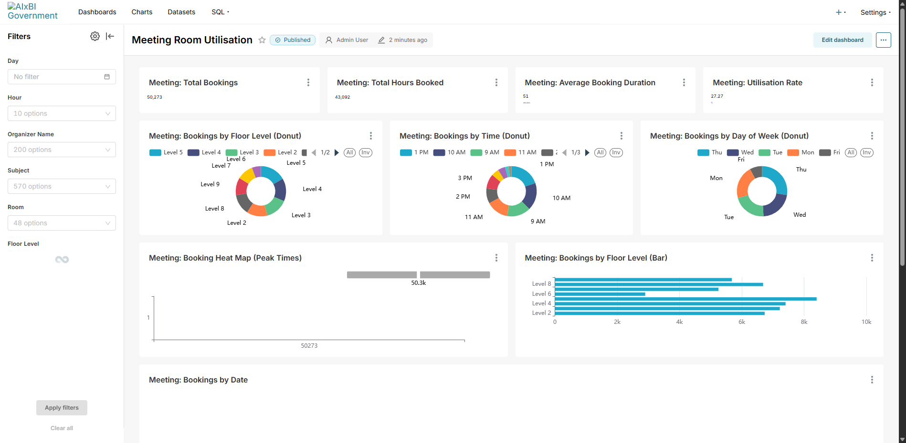

# Superset x Claude MCP — Meeting Room Utilisation

> **AI-automated meeting room analytics: 50,000+ bookings across 8 floors, 50+ rooms, with heatmaps, utilisation tracking, and native filters — built entirely through Claude MCP.**

[](https://superset.apache.org/)
[](https://claude.ai/)
[](https://docs.docker.com/compose/)
[](https://www.postgresql.org/)
[](tests/)

---

## What This Is

A comprehensive meeting room utilisation dashboard replicating a real enterprise corporate analytics report. Every chart, filter, and layout was created programmatically via Apache Superset's API — no manual UI interaction.



## Architecture

```
┌─────────────────────────┐
│   PostgreSQL 16         │  50,273 synthetic booking records
│   (meeting_bookings)    │  Single fact table + denormalised dims
└────────┬────────────────┘
         │ SQLAlchemy
┌────────▼────────────────┐
│   Apache Superset 5.0+  │  Dashboard engine
│   (Docker Compose)      │  13 charts, 6 native filters
└────────┬────────────────┘
         │ MCP Server + REST API
┌────────▼────────────────┐
│   Claude Code / MCP     │  Natural language → API calls
└─────────────────────────┘
```

## Key Metrics

| Metric | Value |
|--------|-------|
| Total Bookings | 50,273 |
| Total Hours Booked | ~43,092 |
| Avg Booking Duration | ~51 minutes |
| Utilisation Rate | ~27.27% |
| Date Range | Jan 2024 — Dec 2026 |
| Rooms | 48 across 8 floors |

## 13 Charts

| # | Chart | Type |
|---|-------|------|
| 1 | Total Bookings | KPI Card |
| 2 | Total Hours Booked | KPI Card |
| 3 | Average Booking Duration | KPI Card |
| 4 | Utilisation Rate | KPI Card |
| 5 | Bookings by Floor Level | Donut |
| 6 | Bookings by Time | Donut |
| 7 | Bookings by Day of Week | Donut |
| 8 | Booking Heat Map (Peak Times) | Heatmap |
| 9 | Bookings by Floor Level | Horizontal Bar |
| 10 | Bookings & Duration by Day of Week | Combo (Bar + Line) |
| 11 | Bookings by Room | Horizontal Bar |
| 12 | Utilisation Rate by Room | Horizontal Bar |
| 13 | Bookings by Date | Time Series Area |

## 6 Native Filters

Date Range, Hour, Organiser Name, Subject, Room, Floor Level — with cross-filtering enabled.

## Colour Palette

| Role | HEX | Usage |
|------|-----|-------|
| Primary | `#002664` | KPI text, time series, line overlays |
| Secondary | `#146cfd` | Emphasis, secondary charts |
| Teal | `#2e808e` | Category splits |
| Baby Blue | `#8ce0ff` | Backgrounds |
| Soft Pink | `#ffb8c1` | Donut segments, bar charts |
| Alert | `#630019` | Heatmap high, utilisation bars |
| Neutral | `#d1eeea` | Heatmap low, gridlines |

## Data Model

Single fact table with denormalised dimensions for simplicity:

```
meeting_bookings (50,273 rows)
├── booking_id, organizer_name, room_name, floor_level, floor_level_name
├── subject, start_datetime, end_datetime, start_date
├── day_of_week, day_of_week_number, hour_ampm, hour_of_day
├── duration_minutes, is_cancelled
└── total_available_minutes, total_minutes_booked, utilisation_rate
```

48 rooms across 8 floors (Level 2–9), naming: `{floor}.{wing}.{seq}-S{size}-VC`

200 organisers across 6 dummy regions (Region A–E + Central Office)

## Quick Start

```bash
git clone https://github.com/yujiyamane/superset-claude-meeting.git
cd superset-claude-meeting

# Start Superset + PostgreSQL
docker compose up -d

# Load data and build dashboard
python scripts/load_meeting_data.py
python scripts/create_meeting_charts.py
python scripts/create_meeting_dashboard.py

# Open http://localhost:8088
```

## Testing

28 tests across 3 test files:

```bash
python -m pytest tests/ -v
```

| Test File | Tests | Coverage |
|-----------|-------|----------|
| test_meeting_data.py | 16 | Data quality, format, org name safety |
| test_meeting_charts.py | 9 | Chart existence, types, counts |
| test_meeting_dashboard.py | 3 | Dashboard, chart links, filters |

## Repository Structure

```
superset-claude-meeting/
├── README.md
├── docker-compose.yml
├── requirements.txt
├── superset/
│   ├── color_theme.py
│   ├── superset_config.py
│   └── dashboards/
│       └── meeting_room_utilisation.zip
├── data/
│   ├── generate_meeting_data.py
│   └── meeting_schema.sql
├── scripts/
│   ├── superset_client.py
│   ├── load_meeting_data.py
│   ├── create_meeting_charts.py
│   ├── create_meeting_dashboard.py
│   ├── export_meeting_dashboard.py
│   └── take_meeting_screenshots.py
├── tests/
│   ├── test_meeting_data.py
│   ├── test_meeting_charts.py
│   └── test_meeting_dashboard.py
└── screenshots/
    ├── meeting_dashboard_overview.png
    ├── meeting_kpi_cards.png
    ├── meeting_donuts.png
    └── meeting_heatmap.png
```

## Related Projects

| Case | Focus | Repo |
|------|-------|------|
| Case 1 | Power BI x Healthcare KPI | [powerbi-claude-health](https://github.com/yujiyamane/powerbi-claude-health) |
| Case 2 | Streamlit x ED Performance | [streamlit-claude-health](https://github.com/yujiyamane/streamlit-claude-health) |
| Case 3 | Life OS x Personal Analytics | [lifeos-claude-dashboard](https://github.com/yujiyamane/lifeos-claude-dashboard) |
| Case 4 | Superset x Healthcare ED + RLS | [superset-claude-health](https://github.com/yujiyamane/superset-claude-health) |
| **Case 5** | **Superset x Meeting Room Utilisation** | **This repo** |

## Author

**Yuji Yamane** — Senior Engineer / AI-Augmented BI Solutions Lead
